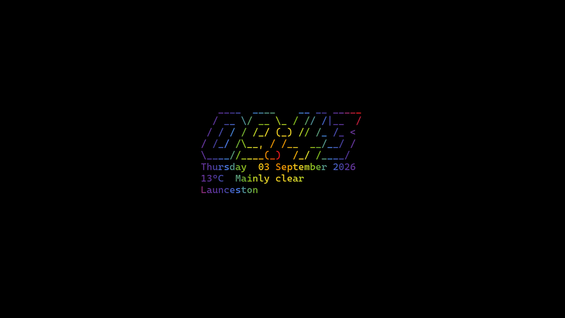

# TTE Screensaver (live dashboard fork)



[](https://gmcclelland90.github.io/tte-screensaver/)

A focused fork of [limehawk/tte-screensaver](https://github.com/limehawk/tte-screensaver) (MIT). Credit to **limehawk** for the original multi-monitor pygame screensaver and Terminal Text Effects pipeline.

Generated ASCII for **local time + date + weather** is the TTE input. Effects animate every character — there is no second HUD. The static LIMEHAWK logo remains as fallback when the live dashboard is off.

---

## Live dashboard

Live dashboard is **on by default**: a figlet clock, a date line, and optional weather become the ASCII that TTE effects animate.

- **Time** is local (`datetime.now()`). Default 24h as `HH:MM` (no seconds — seconds would freeze until the next effect). 12h looks like `3:45 PM`.
- **Date** under the clock, e.g. `Thursday  03 September 2026`.
- **Weather** under that when latitude/longitude are set, e.g. `22°C  Partly cloudy` or `72°F  Clear`.
- Optional **location label** on an extra line.

Set **latitude/longitude** in Settings (paste from Google Maps). Weather uses [Open-Meteo](https://open-meteo.com/) (no API key). If coords are unset or you are offline, time/date still show; last good weather is cached ~12 minutes.

**Max effect seconds** (default 45) caps long effects like Matrix so they do not freeze an old minute on screen. ASCII is refreshed only when a new effect is created (including the preload thread).

---

## Quick Start

### Run from source

```bash
python run.py        # config dialog
python run.py /s     # screensaver
```

### Build

```bash
build.bat
# Output: dist/tte-screensaver.scr
```

### Install

Right-click the `.scr` → **Install**, or copy to `C:\Windows\System32`, then **Personalize → Lock screen → Screen saver settings → tte-screensaver**.

Settings persist in `%APPDATA%\tte-screensaver\config.json`.

---

## Configuration Options

| Setting | Description |
|---------|-------------|
| **Use live dashboard** | Figlet clock + date + optional weather as TTE ASCII (default on) |
| **Clock format** | `24h` or `12h` |
| **Figlet font** | Default `slant` |
| **Latitude / longitude** | Paste from Google Maps. Leave empty for time/date only |
| **Temperature unit** | Celsius or Fahrenheit |
| **Location label** | Optional extra line under weather |
| **Max effect seconds** | Switch effects at least this often (default 45) |
| **ASCII Art** | Fallback logo when live dashboard is off |
| **Enabled Effects** | Select which of the 35+ effects to cycle through |
| **Font Size** | Text rendering size (default: 18) |
| **Target FPS** | Animation smoothness (default: 120) |

---

## Available Effects

<details>
<summary>Click to see all 35+ effects</summary>

- Beams, BinaryPath, Blackhole, BouncyBalls, Bubbles
- Burn, ColorShift, Crumble, Decrypt, ErrorCorrect
- Expand, Fireworks, Highlight, LaserEtch, Matrix
- MiddleOut, OrbittingVolley, Overflow, Pour, Print
- Rain, RandomSequence, Rings, Scattered, Slice
- Slide, Spotlights, Spray, Swarm, Sweep
- SynthGrid, Unstable, VHSTape, Waves, Wipe

</details>

---

## Building from Source

```bash
git clone https://github.com/limehawk/tte-screensaver.git
cd tte-screensaver

pip install -r requirements.txt

python run.py        # Config dialog
python run.py /s     # Screensaver

build.bat
# Output: dist/tte-screensaver.scr
```

### Requirements

- Windows 10/11
- Python 3.10+
- Dependencies: terminaltexteffects, pygame, pyfiglet

---

## Command Line

| Flag | Action |
|------|--------|
| `/s` | Run screensaver fullscreen |
| `/c` | Show configuration dialog |
| `/p` | Preview mode (not implemented) |
| *(none)* | Show configuration dialog |

---

## Credits

- Fork of [limehawk/tte-screensaver](https://github.com/limehawk/tte-screensaver) by limehawk
- Powered by [TerminalTextEffects](https://github.com/ChrisBuilds/terminaltexteffects) by ChrisBuilds
- Inspired by [Omarchy Linux](https://github.com/basecamp/omarchy) screensaver
- Weather from [Open-Meteo](https://open-meteo.com/)

---

## License

MIT License - see [LICENSE](LICENSE) (from upstream limehawk).
